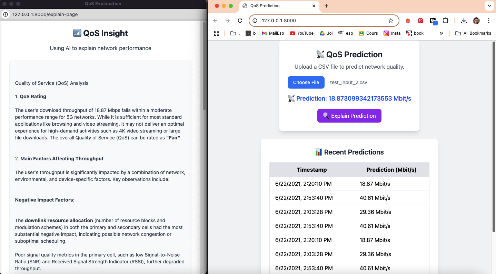

# QoS Prediction with MLOps



[](https://fastapi.tiangolo.com/)
[](https://www.docker.com/)
[](https://mlflow.org/)
[](https://www.postgresql.org/)
[](https://www.python.org/)

---

## 📡 Project Overview

This project predicts network throughput — a key indicator of Quality of Service (QoS) in 5G networks — using machine learning. It integrates a full MLOps pipeline, SHAP explainability, and GPT-powered human-readable insights. Everything runs on a Dockerized stack with FastAPI and a simple frontend for real-time use.

---

## ✨ Features

### Frontend
- Upload CSV to get QoS predictions
- View GPT-powered QoS insights per prediction
- Explanations are cached to avoid repeated API calls
- One-click export as PDF

### Backend
- FastAPI for prediction, SHAP explainability, and GPT insight
- Uses SHAP values to interpret each prediction
- GPT-4o via GitHub Marketplace generates human-readable QoS summaries
- PostgreSQL stores results

### MLOps Pipeline
- Data preparation, model training, evaluation
- MLflow logs model performance and artifacts
- Supports structured Makefile commands

---

## 🗂️ Project Structure

```
├── static/                  # Frontend HTML + JS
├── services/                # SHAP + GPT logic
├── model_pipeline.py        # Sklearn pipeline + preprocessing
├── app.py                   # FastAPI server
├── main.py                  # MLOps training & evaluation
├── docker-compose.yml       # Orchestrates app + DB + MLflow
├── requirements.txt         # Dependencies
├── Makefile                 # Commands for MLOps & server
└── .env                     # Environment variables (not tracked)
```

---

## ⚙️ Setup

```bash
# Clone repo
git clone https://github.com/RideneFiras/QosMLOPS.git
cd QosMLOPS

#Create and activate a virtual environment (recommended)
python -m venv qos
source qos/bin/activate

# Install Python dependencies
pip install -r requirements.txt

# Train model and prepare everything
make all

# Start FastAPI and web UI
make fastapi

# Or launch with Docker
docker-compose up --build
```

---

## 🧠 GPT Insight System

Once the model predicts throughput:
- SHAP values explain feature impact
- GPT-4o generates a readable QoS report
- Insight includes:
  - QoS rating (Very Low → Very Good)
  - Key influencing factors
  - Network improvement suggestions
- Markdown is rendered cleanly in the browser
- Users can export the result as a PDF

---

## 🧪 Usage Guide

- Open [http://127.0.0.1:8000](http://127.0.0.1:8000)
- Upload a CSV with test samples
- Click “Explain” next to any prediction
- Read GPT-based summary of throughput performance
- Click **Print / Save as PDF** to export the result

---

## 🔑 Environment Variables

- `DATABASE_URL`: PostgreSQL connection string  
- `GITHUB_TOKEN`: GitHub token for GPT API access  
- Store them in a `.env` file (not tracked by git)

---

## 🔧 Makefile Commands

```bash
make prepare     # Prepare the dataset
make train       # Train the ML model
make evaluate    # Evaluate performance
make predict     # Run batch predictions
make fastapi     # Start FastAPI + UI
make mlflow      # Launch MLflow tracking
make docker-run  # Run app with Docker
```

---

## ⚙️ Tech Stack

- **Python** & **Scikit-learn**
- **FastAPI** for serving
- **SHAP** for explainability
- **GPT-4o (via GitHub API)** for natural language insight
- **MLflow** for experiment tracking
- **PostgreSQL** for database storage
- **Tailwind CSS** for UI
- **Docker & Docker Compose** for orchestration

---

## ✅ Notes

This project demonstrates an end-to-end pipeline for AI-powered QoS prediction and explainability. It's optimized for real-world deployment and includes production-ready tooling for interpretability, maintainability, and user communication.