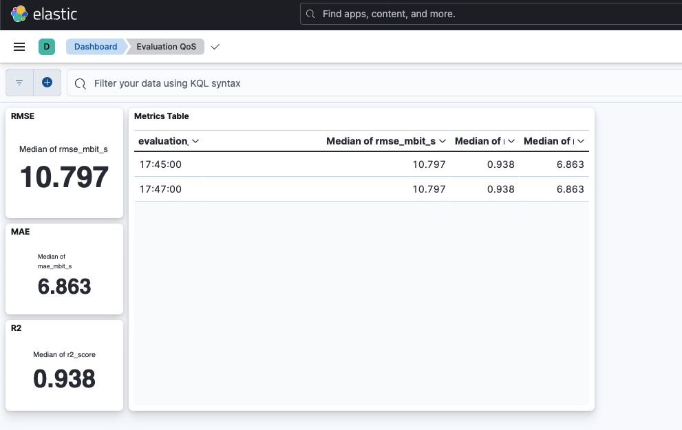

# QoS Prediction (throughput)


[](https://fastapi.tiangolo.com/)
[](https://www.docker.com/)
[](https://mlflow.org/)
[](https://www.postgresql.org/)
[](https://www.python.org/)

---

## 📡 Project Overview

## 📡 Project Overview

This project predicts network throughput — a key indicator of Quality of Service (QoS) in 5G networks — using machine learning. It features a full MLOps pipeline with **MLflow tracking**, **Elasticsearch-based evaluation dashboards**, **SHAP explainability**, and **GPT-powered QoS insights**. The system runs on a fully Dockerized stack using **FastAPI** and a simple web frontend for real-time use.

---

This work was developed as part of the **Integrated Project** at [Esprit School of Engineering](https://esprit.tn/), under the guidance of professors **Rahma Bouraoui**, **Safa Cherif**, and **Zaineb Labidi**.


---

## ✨ Features

### Frontend
- Upload CSV to get QoS predictions
- GPT-powered explanations with SHAP insights
- Caching avoids repeated GPT API calls
- Export results as PDF

### Backend
- FastAPI for predictions, explainability, and GPT summaries
- Uses SHAP values to explain model decisions
- GPT-4o via GitHub API creates human-readable reports
- PostgreSQL stores predictions & insights

### MLOps Pipeline
- Data preprocessing, model training, evaluation
- **MLflow** logs parameters, metrics, and artifacts
- **Elasticsearch** logs evaluation metrics for monitoring dashboards
- Simple CLI via `Makefile` commands

🖼️ Kibana Evaluation Dashboard:



---

## 🗂️ Project Structure

```
├── static/                 # Frontend HTML + JS
├── services/               # SHAP explainability + GPT interpretation logic
├── Dataset/                # Training and test data (CSV)
├── Models/                 # Saved models and processed data
├── assets/                 # Visuals (e.g. Elastic dashboard screenshots)
├── testinput/              # Example input for testing predictions
├── app.py                  # FastAPI server
├── main.py                 # MLOps training & evaluation pipeline
├── model_pipeline.py       # Sklearn training, preprocessing, evaluation
├── csvv.py                 # CSV parsing logic
├── docker-compose.yml      # Orchestrates app + DB + Elasticsearch + MLflow
├── Dockerfile              # Container for FastAPI + logic
├── Makefile                # CLI commands for training, evaluation, etc.
├── requirements.txt        # Python dependencies
├── .env.example            # Example environment variable file
├── .flake8 / .pre-commit/  # Code quality configuration
├── README.md               # Project overview and instructions
```

---

## ⚙️ Setup

```bash
# Clone repo
git clone https://github.com/RideneFiras/QosMLOPS.git
cd QosMLOPS

# Create and activate a virtual environment (recommended)
python -m venv qos
source qos/bin/activate

# Install Python dependencies
pip install -r requirements.txt

# Train model and prepare everything
make all

# Start FastAPI and web UI
make fastapi

# Or launch entire stack with Docker
docker-compose up --build
```

---

## 🧠 GPT Insight System

After the model predicts throughput:
- SHAP explains feature impact per prediction
- GPT-4o turns SHAP values into a readable QoS summary
- Insights include:
  - Overall QoS rating (e.g. Very Low → Very Good)
  - Top influencing features
  - Suggestions to improve performance
- Markdown is rendered cleanly in-browser
- Export as PDF with a single click

---

## 🧪 Usage Guide

- Visit [http://127.0.0.1:8000](http://127.0.0.1:8000)
- Upload your test CSV
- Click “Explain” next to any result
- Read GPT-powered QoS explanation
- Save report as PDF if needed

---

## 🔑 Environment Variables

Store these in a `.env` file (not tracked by git):

- `DATABASE_URL` — PostgreSQL connection string  
- `GITHUB_TOKEN` — GitHub token for GPT API access  
- `IS_DOCKER` — Set to `true` inside containers (used for routing)

---

## 🔧 Makefile Commands

## 🔧 Makefile Commands

```bash
make all          # Run full pipeline: prepare → train → evaluate → predict
make train        # Train the ML model and log to MLflow
make evaluate     # Evaluate performance and send metrics to MLflow & Elastic
make fastapi      # Start FastAPI locally (with database in background)
make services-up  # Start Elasticsearch, Kibana, PostgreSQL, and MLflow (Docker)
make docker-run   # Run the entire app in Docker (FastAPI + dependencies)
make docker-down  # Stop all running Docker containers
make notebook     # Launch Jupyter Notebook
make check        # Run both code formatting (Black) and linting (Flake8)
make clean        # Remove cache, .pkl files, and logs
```


---

## ⚙️ Tech Stack

- **Python** & **Scikit-learn**
- **FastAPI** + **SHAP** + **GPT-4o**
- **MLflow** for model tracking
- **Elasticsearch + Kibana** for evaluation dashboards
- **PostgreSQL** for storing prediction results
- **Tailwind CSS** for styling
- **Docker** for deployment

---

## ✅ Notes

This is an end-to-end, real-world MLOps project combining AI explainability, model monitoring, and GPT summarization. Designed with clarity, reliability, and user insights in mind — ready for production.
