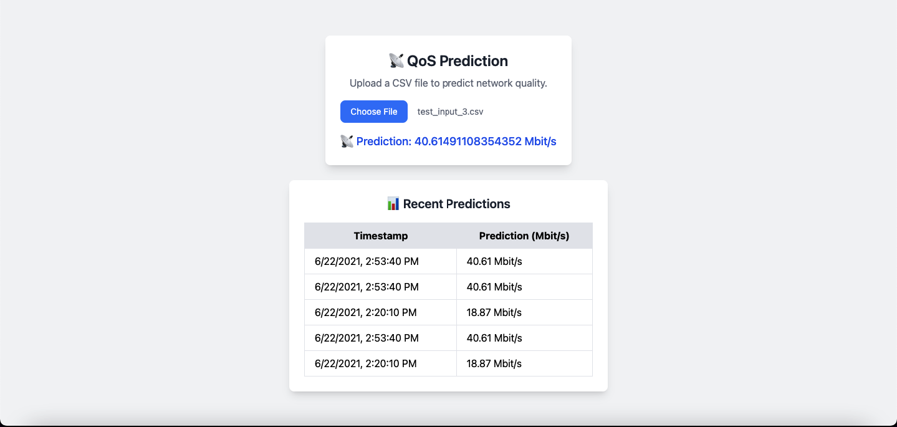

# QoS Prediction with MLOps



[](https://fastapi.tiangolo.com/)
[](https://www.docker.com/)
[](https://mlflow.org/)
[](https://www.postgresql.org/)
[](https://www.python.org/)

This project predicts network Quality of Service (QoS) using machine learning models. It integrates a full MLOps pipeline, including data preparation, model training, evaluation, and deployment using FastAPI. The project also includes Docker and Docker Compose for containerization and orchestration, along with advanced features for real-time predictions and data visualization.

---

## Features

- **Frontend**: A web interface for uploading CSV files and viewing predictions.
- **Backend**: A FastAPI server for handling predictions and storing results in a PostgreSQL database.
- **MLOps Pipeline**: Data preparation, model training, evaluation, and prediction.
- **MLflow Integration**: Tracks experiments and model artifacts.
- **Elasticsearch & Kibana**: For logging and visualization.
- **Dockerized Deployment**: Fully containerized with Docker Compose.
- **Dynamic Predictions Table**: Displays the last 10 predictions in real-time.
- **CSV Parsing**: Converts uploaded CSV files into JSON for model input.
- **PostgreSQL Integration**: Stores predictions with timestamps for future analysis.
- **CORS Support**: Allows cross-origin requests for frontend-backend communication.
- **Model Persistence**: Trained models are saved and loaded for predictions.

---

## Project Structure

- **`static/`**: Contains the frontend HTML, CSS, and JavaScript files.
- **`main.py`**: Entry point for running the MLOps pipeline.
- **`app.py`**: FastAPI application for serving predictions and the frontend.
- **`Dockerfile`**: Defines the Docker image for the project.
- **`docker-compose.yml`**: Orchestrates multiple services (FastAPI, PostgreSQL, MLflow, Elasticsearch, Kibana).
- **`Makefile`**: Simplifies common tasks like training, evaluating, and deploying.

---

## Prerequisites

- **Python 3.10**
- **Docker & Docker Compose**
- **Node.js** (optional, for frontend development)

---

## Setup Instructions

1. **Clone the Repository**:
   ```bash
   git clone https://github.com/RideneFiras/QosMLOPS.git
   cd QosMLOPS
   ```

2. **Install Python Dependencies**:
   ```bash
   pip install -r requirements.txt
   ```

3. **Run the MLOps Pipeline**:
   ```bash
   make all
   ```

4. **Start the FastAPI Server**:
   ```bash
   make fastapi
   ```

5. **Launch MLflow**:
   ```bash
   make mlflow
   ```

6. **Run with Docker Compose**:
   ```bash
   docker-compose up --build
   ```

---

## Usage

### Frontend
- Open the web interface at `http://127.0.0.1:8000/`.
- Upload a CSV file to predict QoS.
- View recent predictions in the table.

### Backend
- Access the FastAPI docs at `http://127.0.0.1:8000/docs`.
- Use the `/predict` endpoint to send data for predictions.
- Retrieve stored predictions from the `/predictions` endpoint.

---

## Key Commands

- **Prepare Data**:
  ```bash
  make prepare
  ```
- **Train Model**:
  ```bash
  make train
  ```
- **Evaluate Model**:
  ```bash
  make evaluate
  ```
- **Generate Predictions**:
  ```bash
  make predict
  ```

---

## Docker Commands

- **Build Docker Image**:
  ```bash
  make docker-build
  ```
- **Run Docker Container**:
  ```bash
  make docker-run
  ```
- **Push to Docker Hub**:
  ```bash
  make docker-push
  ```

---

## Environment Variables

- `DATABASE_URL`: PostgreSQL connection string.
- `MLFLOW_TRACKING_URI`: MLflow tracking server URI.

---

## Technologies Used

- **FastAPI**: Backend API framework.
- **PostgreSQL**: Database for storing predictions.
- **MLflow**: Experiment tracking and model management.
- **Elasticsearch & Kibana**: Logging and visualization.
- **Docker**: Containerization.
- **Tailwind CSS**: Frontend styling.

---

## Notes

This project is designed to showcase the integration of machine learning and MLOps principles. It demonstrates the use of modern tools and frameworks to build a scalable and maintainable pipeline for QoS prediction.
